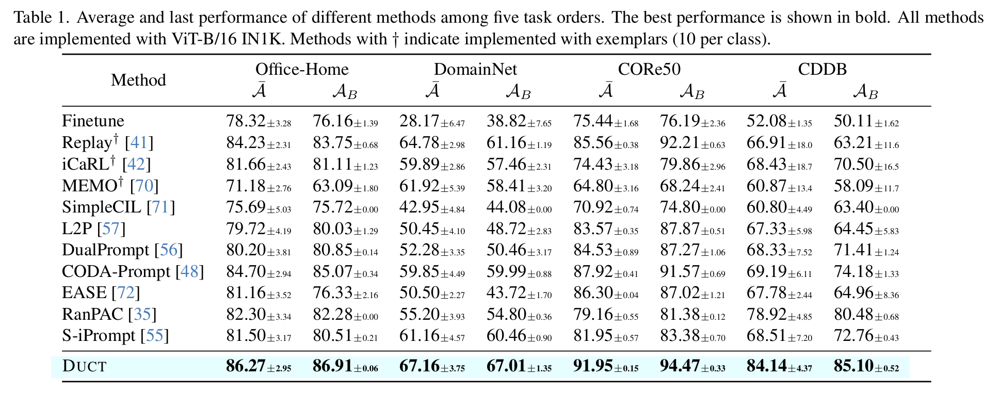

# Dual Consolidation for Pre-Trained Model-Based Domain-Incremental Learning

<div align="center">

<div>
    <a href='http://www.lamda.nju.edu.cn/zhoudw' target='_blank'>Da-Wei Zhou</a>&emsp;
    <a href='http://www.lamda.nju.edu.cn/caizw' target='_blank'>Zi-Wen Cai</a>&emsp;
    <a href='http://www.lamda.nju.edu.cn/yehj' target='_blank'>Han-Jia Ye</a>&emsp;
    <a href='https://ai.nju.edu.cn/zlj/' target='_blank'>Lijun Zhang </a>&emsp;
    <a href='http://www.lamda.nju.edu.cn/zhandc' target='_blank'>De-Chuan Zhan</a>
</div>
<div>
School of Artificial Intelligence, State Key Laboratory for Novel Software Technology, Nanjing University&emsp;
</div>
</div>

\
The code repository for "[Dual Consolidation for Pre-Trained Model-Based Domain-Incremental Learning](https://arxiv.org/abs/2410.00911)" (CVPR 2025) in PyTorch.  If you use any content of this repo for your work, please cite the following bib entry: 

    @inproceedings{zhou2025duct,
        title={Dual Consolidation for Pre-Trained Model-Based Domain-Incremental Learning},
        author={Da-Wei Zhou and Zi-Wen Cai and Han-Jia Ye and Lijun Zhang and De-Chuan Zhan},
        booktitle={CVPR},
        year={2025},
    }


## Updates
[02/2025] Accepted to CVPR 2025.


## Introduction

Domain-Incremental Learning (DIL) involves the progressive adaptation of a model to new concepts across different domains. While recent advances in pre-trained models provide a solid foundation for DIL, learning new concepts often results in the catastrophic forgetting of pre-trained knowledge. Specifically, sequential model updates can overwrite both the representation and the classifier with knowledge from the latest domain. Thus, it is crucial to develop a representation and corresponding classifier that accommodate all seen domains throughout the learning process.
To this end, we propose **DUal ConsolidaTion** (**DUCT**) to unify and consolidate historical knowledge at both the representation and classifier levels. 
By merging the backbone of different stages, we create a representation space suitable for multiple domains incrementally. The merged representation serves as a balanced intermediary that captures task-specific features from all seen domains. Additionally, to address the mismatch between consolidated embeddings and the classifier, we introduce an extra classifier consolidation process. Leveraging class-wise semantic information, we estimate the classifier weights of old domains within the latest embedding space. By merging historical and estimated classifiers, we align them with the consolidated embedding space, facilitating incremental classification. Extensive experimental results on four benchmark datasets demonstrate DUCT's state-of-the-art performance.


<div align="center">


</div>


## Requirements

### Environment

You can create a conda environment and run the following command to install the dependencies.
```
conda install --file requirements.txt
```

### Dataset

There are **4** datasets involved in the paper, CDDB, CORe50, DomainNet and Office-Home respectively. Follow the two-step guideline to prepare them for the reproduction.

1. Download the datasets mannually according the recommended.
    - **CDDB**: You can access the dataset at this [link](https://coral79.github.io/CDDB_web/).
    - **CORe50**: You can access the dataset at this [link](https://vlomonaco.github.io/core50/index.html#dataset). Please download the `core50_imgs.npz` file.
    - **DomainNet**: You can access the dataset at this [link](http://ai.bu.edu/M3SDA/). Please download the `cleaned version` file.
    - **Office-Home**: You can access the dataset at this [link](https://hemanthdv.github.io/officehome-dataset/).
2. Check if the dataset has been downloaded properly. The dataset directory is expected to have the following structure:
    ```
    CDDB
    ├── biggan
    ├── crn 
    ├── ...
    ├── wild
    
    CORe50
    ├── s1
    ├── ...
    ├── s11
    ├── labels.pkl
    ├── LUP.pkl
    ├── paths.pkl
    
    DomainNet
    ├── clipart
    ├── ...
    ├── sketch
    ├── clipart_test.txt
    ├── clipart_train.txt
    ├── ...

    OfficeHome
    ├── Art
    ├── Clipart
    ├── Product
    ├── Real_World

    ```
3. Specify the dataset path in the config file under the `configs` directory.
    ```
    "data_path": "$Your/Dataset/Path/Here$"
    ```

## Running scripts

```
python main.py --config configs/Template_domainnet_duct.json
```

## Performance

The main results have been listed below.

<div align="center">


</div>


## Acknowledge 
This repo is based on [S-Prompts](https://github.com/iamwangyabin/S-Prompts) and [PILOT](https://github.com/sun-hailong/LAMDA-PILOT).

## Correspondence
If you have any questions, please contact me via [email](mailto:zhoudw@lamda.nju.edu.cn) or open an [issue](https://github.com/Estrella-fugaz/CVPR25-DUCT/issues/new).


<div align="center">


</div>